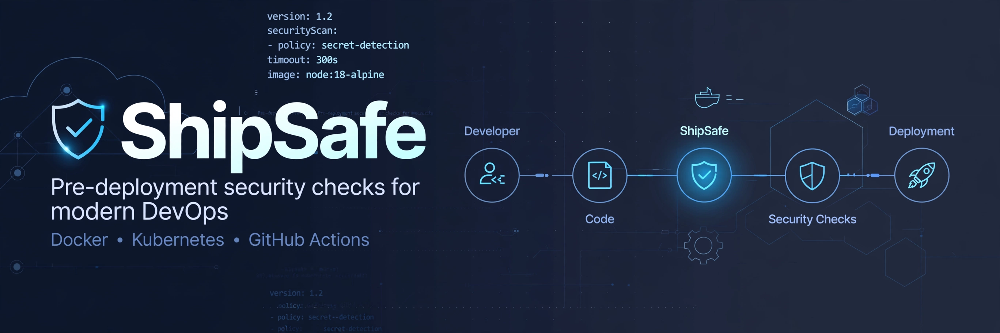
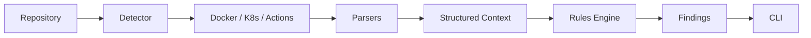

# ShipSafe

**Pre-deployment security checks for modern DevOps**



[](#)
[](#)
[](#)
[](#)

ShipSafe is a lightweight, developer-focused CLI that scans your repository for security and reliability issues **before** deployment. Built for Docker, Kubernetes, and GitHub Actions.

> Static analysis only. Fast, local, no daemon or cluster required.

---

## Why ShipSafe?

Most production failures are preventable configuration mistakes:

- Containers running as root, using `:latest`, missing `HEALTHCHECK`
- Kubernetes Services targeting non-existent ports, missing probes or resource limits
- GitHub Actions with unpinned actions, `write-all` permissions, or leaked secrets

ShipSafe catches these at the source, in your repo, before CI/CD ships them.

## Features

- **Zero-config detection** - auto-detects Docker, Kubernetes, and Actions
- **15 focused rules** - high-signal checks only, no noise
- **Clean architecture** - Detection → Parsing → Context → Rules → Findings
- **Extensible** - add a new rule in < 30 lines of code
- **Developer-first CLI** - readable output for local dev and CI
- **Fully tested** - automated pytest test suite

## Supported Scanners

| Scanner | What it checks |
| :--- | :--- |
| **Docker** | Dockerfile - base pinning, root user, healthcheck, secrets |
| **Kubernetes** | Manifests - port mismatches, probes, resources, selectors |
| **GitHub Actions** | Workflows - action pinning, permissions, secrets, timeouts |

## Quick Start

### Installation

```bash
# Clone
git clone <repo-url>
cd shipsafe

# Virtual environment
python -m venv .venv
source .venv/bin/activate  # Windows: .venv\Scripts\activate

# Install
pip install -e .

# Verify
shipsafe --help
```

With dev dependencies:

```bash
pip install -e ".[dev]"
```

### Usage

```bash
# Scan current directory
shipsafe scan .

# Scan specific repo
shipsafe scan ./path/to/repo
```

**Example - Issue Found:**

```
$ shipsafe scan .

ShipSafe v0.1.0
===============

Scanning: .

Detected:
  ✓ Docker
  ✓ Kubernetes
  ✓ GitHub Actions

Findings:

  🔴 HIGH  K8S001
     Kubernetes named port mismatch
     Service 'backend-service' targets named port 'grpc',
     but Deployment 'backend' does not define it.

1 issue(s) found.
Scan complete.
```

**Example - Clean:**

```
Detected:
  ✓ Docker
  ✓ Kubernetes
  ✓ GitHub Actions

No issues found.
Scan complete.
```

## Rules Reference

### Docker

| ID | Rule | Severity |
| :--- | :--- | :--- |
| DOCKER001 | Unpinned base image | HIGH |
| DOCKER002 | Running container as root | HIGH |
| DOCKER003 | Missing HEALTHCHECK | MEDIUM |
| DOCKER004 | Using latest tag | MEDIUM |
| DOCKER005 | Potential hard-coded secret | CRITICAL |

### Kubernetes

| ID | Rule | Severity |
| :--- | :--- | :--- |
| K8S001 | Service targets named port not defined in Deployment | HIGH |
| K8S002 | Missing readiness probe | MEDIUM |
| K8S003 | Service selector does not match any Deployment | HIGH |
| K8S004 | Duplicate service port name | MEDIUM |
| K8S005 | Missing resource requests/limits | MEDIUM |

### GitHub Actions

| ID | Rule | Severity |
| :--- | :--- | :--- |
| GHA001 | Unpinned third-party action (no SHA pin) | HIGH |
| GHA002 | Excessive workflow permissions | HIGH |
| GHA003 | Potential hard-coded secret | CRITICAL |
| GHA004 | Missing job timeout (timeout-minutes) | MEDIUM |
| GHA005 | Dangerous pull_request_target usage | CRITICAL |

**Severity:**

- **CRITICAL**: Must fix - secrets, dangerous triggers
- **HIGH**: Likely security/reliability issue
- **MEDIUM**: Best practice, reliability improvement

## How It Works

```
Repository → Detector → Parsers → Structured Context → Rules → Findings → CLI
```

1. **Detector** identifies what tech exists in the repo
2. **Parsers** (`docker.py`, `kubernetes.py`, `github_actions.py`) understand config
3. **Context** normalizes data into structured models
4. **Rules** evaluate context
5. **Findings** standardize results
6. **CLI** presents to developer



## Project Structure

```
shipsafe/
├── README.md
├── pyproject.toml
├── assets/
│   └── shipsafe-banner.png
├── src/shipsafe/
│   ├── cli.py
│   ├── parsers/
│   │   ├── docker.py
│   │   ├── kubernetes.py
│   │   └── github_actions.py
│   ├── scanner/
│   │   ├── detector.py
│   │   ├── context.py
│   │   ├── engine.py
│   │   └── result.py
│   └── rules/
│       ├── docker/
│       ├── kubernetes/
│       └── github_actions/
└── tests/
```

## Architecture Principles

> **Detection identifies** what exists.  
> **Parsers understand** the configuration.  
> **Rules determine** whether something is wrong.  
> **Findings provide** standardized results.  
> **CLI presents** results to the developer.

Adding a new check = add one file in `rules/<scanner>/` and register it. No engine changes needed.

## Testing

```bash
pytest
pytest --cov=shipsafe
pytest -v -k docker
```

Covers Docker parsing, Docker rules, Kubernetes parsing, Kubernetes port mismatch, Kubernetes rules, and GitHub Actions rules.

## Roadmap

**v0.1.0 - Done:**
- [x] Detector + 3 scanners
- [x] 15 initial rules
- [x] Finding model + CLI

**Next:**
- [ ] JSON and SARIF output (`--format sarif`)
- [ ] Config file `shipsafe.toml` to enable/disable rules
- [ ] Severity filtering `--fail-on`
- [ ] GitHub Action for CI
- [ ] pre-commit hook
- [ ] More rules: securityContext, livenessProbe, OIDC, network policies

## CI/CD Integration (Planned)

ShipSafe is designed to run in CI. Future support:

- **GitHub Actions** - native action + SARIF upload to Security tab
- **Jenkins / GitLab CI** - JSON output
- **pre-commit** - block commits with CRITICAL findings
- **SARIF** - for DefectDojo, GitHub Code Scanning

## Security Notes

ShipSafe is static analysis only. It does not:
- Scan image layers or CVEs (use Trivy/Grype for that)
- Guarantee complete security
- Replace dedicated secret scanners

Always use alongside runtime and image scanners.

## Project Status

**v0.1.0 Alpha** - Core architecture working, 15 rules implemented, CLI functional. Breaking changes expected before 1.0. Breaking changes expected. Not production-hardened yet, but intentionally built to be extensible and recruiter/contributor friendly.

## Contributing

1. Fork and branch
2. Add rule in `rules/<scanner>/`
3. Add tests in `tests/`
4. Ensure `pytest` passes
5. PR with clear description

Keep rules small, pure, and testable.

## License

See `LICENSE` in repository root if present. If no license file exists, no license is implied.

---

**ShipSafe** - ship safe, not just ship fast.
